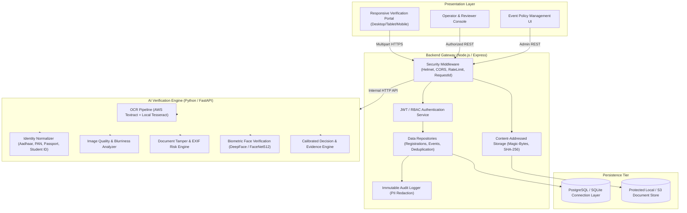

# Enterprise AI-Powered Identity & Eligibility Verification Platform

[](https://github.com/Soumyajit-2808/ai-identity-verification/actions)
[](LICENSE)
[](https://nodejs.org/)
[](https://python.org/)
[](https://www.docker.com/)

A production-grade, multi-tenant identity verification platform designed for hackathons, academic institutions, events, and enterprise onboarding workflows. The platform combines multi-engine OCR, image quality scoring, document tamper analysis, normalized rule-based eligibility evaluation, persistent cryptographic duplicate detection, and optional biometric face matching into an explainable, auditable verification pipeline.

---

## 1. System Architecture

The platform adopts a modular service-oriented architecture, decoupling the client gateway, business logic, persistent state, and AI inference engines:



### Architectural Highlights
- **Decoupled Gateway & AI Worker**: The Node.js Express service manages client authentication, role-based access control, file sanitization, and database persistence, while the FastAPI Python service manages computational OCR and computer vision pipelines.
- **Dual Database Engine**: The repository layer natively supports both **PostgreSQL** (for production clustering) and **SQLite `node:sqlite` DatabaseSync** (for zero-dependency local development and CI testing) with unified positional parameter binding.
- **Content-Addressed Storage**: All uploaded documents and biometric selfies are verified via magic-byte header inspection (JPEG, PNG, WebP, PDF) and stored using SHA-256 checksums to eliminate path traversal vulnerabilities.
- **Explainable Evidence Scoring**: Instead of arbitrary heuristic scores, the decision engine evaluates 8 atomic verification signals (`PASS`, `REVIEW`, `FAIL`, or `SKIPPED`) to compute a mathematically calibrated evidence score ($0.0 \dots 1.0$) and an inverse risk score.

---

## 2. Core Capabilities

### 1. Document Ingestion & Multi-Engine OCR
- **Abstracted OCR Adapter**: Standardized `OCRProvider` interface supporting AWS Textract (cloud production) and Tesseract OCR (local containerized fallback).
- **Format Normalization**: Built-in document extractors for Indian National IDs (**Aadhaar 12-digit**, **PAN 10-char alphanumeric**, **Passport**, **Voter ID**) and University/College Student IDs.
- **Robust Date Parsing**: Handles multi-locale date formats (`DD/MM/YYYY`, `YYYY-MM-DD`, `DD-Mon-YYYY`, `DD.MM.YYYY`).

### 2. Multi-Level Cryptographic Deduplication
- **File-Level Deduplication**: SHA-256 binary hashing prevents re-uploading identical document assets across different applicant profiles.
- **Identity Reuse Detection**: Salted SHA-256 hashing of extracted document identifiers prevents the same legal ID from being registered under different names or email addresses.
- **Concurrency-Safe Persistence**: Replaces in-memory sets with transactional relational tables (`documents`, `identity_registry`).

### 3. Document Quality & Tamper Risk Analysis
- **Quality Indicators**: Quantifies resolution, Laplacian variance (blur detection), brightness, and contrast.
- **Tamper Indicators**: Inspects EXIF editing software tags, quantization table anomalies, aspect ratio distortions, and OCR noise flags.

### 4. Biometric Face Verification
- **DeepFace / FaceNet512 Pipeline**: Compares applicant selfies against ID portrait crops.
- **Explicit Multi-State Detection**: Accurately differentiates `no_face_detected`, `multiple_faces_detected`, `quality_insufficient`, `match`, and `mismatch`.
- **Honest Limitations**: Standard 2D selfie matching is transparently reported as biometric matching without presentation attack / 3D liveness claims.

### 5. Configurable Event Policy & Manual Review Workflows
- **Dynamic Rules**: Organizers can customize minimum/maximum age thresholds, student status requirements, selfie mandates, and allowed document types per event.
- **Operator Review Queue**: Suspicious or low-confidence submissions trigger human review cases (`OPEN`, `IN_REVIEW`, `APPROVED`, `REJECTED`, `ESCALATED`) with full operator attribution and audit logging.

---

## 3. Project Structure

```text
ai-identity-verification/
├── ai-service/                   # Python FastAPI Verification Microservice
│   ├── ocr/                      # Multi-provider OCR abstraction (Textract, Tesseract)
│   ├── verification/             # Specialized signal analyzers (Quality, Tamper, Normalizer, Face, Engine)
│   ├── tests/                    # Synthetic verification unit & integration test runner
│   ├── Dockerfile                # Multi-stage container definition for AI service
│   ├── main.py                   # FastAPI application entrypoint & Pydantic models
│   └── requirements.txt          # Python dependencies
├── backend/                      # Node.js Express Gateway & Persistence Service
│   ├── src/
│   │   ├── db/                   # Database adapter, connection pool, migrations, and repositories
│   │   ├── middleware/           # JWT Auth, RBAC, Structured Logger with PII Masking, Error Handler
│   │   └── storage/              # Magic-byte validation, SHA-256 content-addressing
│   ├── tests/                    # Jest test suites (Persistence, Gateway API, E2E Scenarios)
│   │   └── fixtures/             # Synthetic test fixture generator (Pillow / Python)
│   ├── Dockerfile                # Multi-stage production container for Node.js backend
│   └── server.js                 # Express server & REST API route definitions
├── frontend/                     # Modernized Responsive Verification Portal
│   └── index.html                # Responsive UI (Applicant Portal, Review Queue, Event Policy, Diagnostics)
├── database/                     # Relational schema DDL & migration scripts
│   └── schema.sql                # PostgreSQL & SQLite DDL definition
├── docs/                         # In-depth architectural & operational documentation
│   ├── architecture.md           # System architecture, data flow, and modular design
│   ├── verification-engine.md    # Signal taxonomy, calibration math, and policy rules
│   ├── database.md               # ER diagram, schema indexes, and concurrency controls
│   ├── security.md               # Threat modeling, RBAC, input sanitization, and PII masking
│   ├── privacy.md                # Data minimization, retention policies, and GDPR compliance
│   └── api.md                    # Exhaustive REST API request/response reference
├── docker-compose.yml            # Multi-service orchestration (Postgres, Backend, AI Service)
├── .env.example                  # Standard environment variable configuration template
└── README.md                     # Project overview and developer handbook
```

---

## 4. Quickstart & Local Setup

### Prerequisites
- **Node.js**: v20.x or later
- **Python**: v3.11 or later
- **Tesseract OCR** (optional for local OCR): `tesseract-ocr` package on Linux / macOS or installer on Windows.

### Method A: Local Native Development (Zero-Config SQLite)

1. **Clone the Repository**:
   ```bash
   git clone https://github.com/Soumyajit-2808/ai-identity-verification.git
   cd ai-identity-verification
   ```

2. **Configure Environment Variables**:
   ```bash
   cp .env.example .env
   # Default settings utilize in-process SQLite and local AI service on port 8001
   ```

3. **Install & Start AI Verification Service**:
   ```bash
   cd ai-service
   python -m venv venv
   # Activate virtualenv (Windows: .\venv\Scripts\activate | Unix: source venv/bin/activate)
   pip install -r requirements.txt
   python -m uvicorn main:app --host 127.0.0.1 --port 8001
   ```

4. **Install, Migrate & Start Backend Gateway**:
   ```bash
   cd ../backend
   npm install
   node src/db/migrate.js     # Seeds initial organization, event HACK2026, and admin/reviewer users
   npm start                  # Starts Express server on http://localhost:3000
   ```

5. **Access the Application**:
   - **Verification Portal & Dashboard**: Open [http://localhost:3000](http://localhost:3000)
   - **Operator Review Login**: Click "Operator Login" and use credentials:
     - **Email**: `admin@hackathon.org` | **Password**: `Password123!`
     - **Email**: `reviewer@hackathon.org` | **Password**: `Password123!`
   - **AI Service OpenAPI Docs**: Open [http://127.0.0.1:8001/docs](http://127.0.0.1:8001/docs)

---

### Method B: Containerized Deployment (Docker Compose)

Launch the complete multi-service stack with a dedicated PostgreSQL instance:

```bash
docker-compose up --build -d
```

Services will initialize on:
- `http://localhost:3000` — Gateway & Web UI
- `http://localhost:8001` — AI Verification Service
- `localhost:5432` — PostgreSQL Database

---

## 5. Automated Testing Suite

The repository includes comprehensive automated test coverage across unit, integration, and end-to-end verification workflows:

### 1. Generate Synthetic Test Fixtures
To generate clean, synthetic, non-PII test documents for automated testing:
```bash
python backend/tests/fixtures/generate_fixtures.py
```
This generates programmatic test cards: `valid_id.png`, `minor_id.png`, `different_name_id.png`, `blurry_id.png`, and `selfie.png`.

### 2. Run Backend & E2E Acceptance Tests
```bash
cd backend
npm test
```
**Test Coverage Includes**:
- `persistence.test.js`: Dual-engine database queries, exact duplicate file blocking, and cross-registration identity reuse detection.
- `api.test.js`: Health diagnostics, rate limiting, JWT token generation, RBAC authorization, and input validation.
- `e2e_scenarios.test.js`: Full multipart pipeline execution including:
  - Valid adult applicant (`APPROVED`)
  - Underage applicant rejection (`REJECTED`)
  - Conflicting name manual review (`REVIEW`)
  - Exact duplicate document rejection (`REJECTED`)
  - Identity reuse under different identity (`REJECTED`)
  - Missing file handling (`VALIDATION_ERROR`)
  - Operator review queue retrieval and decision resolution (`RESOLVED`)

### 3. Run AI Service Unit Tests
```bash
cd ai-service
python tests/run_tests.py
```
**Test Coverage Includes**:
- Date parsing & age calculation across diverse international formats
- Advanced token-set, Jaro-Winkler, and Levenshtein name matching
- Image quality sharpness and blur detection
- Multi-signal decision engine resolution and evidence scoring

---

## 6. Observability & System Diagnostics

The platform provides built-in health monitoring and telemetry endpoints:

```bash
# System Health & Dependency Status
curl http://localhost:3000/api/health
```
```json
{
  "status": "healthy",
  "version": "2.0.0",
  "database": { "status": "connected", "engine": "sqlite" },
  "aiService": { "status": "connected", "latencyMs": 12 }
}
```

```bash
# Aggregated Metrics & Backlog Counters
curl http://localhost:3000/api/metrics
```
```json
{
  "totalVerifications": 42,
  "decisions": { "ELIGIBLE": 32, "REVIEW": 8, "INELIGIBLE": 2 },
  "openReviews": 3,
  "averageProcessingTimeMs": 310
}
```

---

## 7. Security & Compliance Reference

Detailed technical specifications are available in the [`docs/`](./docs/) directory:

- [**Architecture Specification** (`docs/architecture.md`)](./docs/architecture.md): Service boundaries, data flow diagrams, and design trade-offs.
- [**Verification Engine** (`docs/verification-engine.md`)](./docs/verification-engine.md): Mathematical formulas for evidence scoring, signal thresholds, and decision policy tables.
- [**Database Architecture** (`docs/database.md`)](./docs/database.md): Schema ER diagram, relational foreign keys, indexes, and concurrency controls.
- [**Security Architecture** (`docs/security.md`)](./docs/security.md): Threat modeling (STRIDE), input sanitization, magic-byte checks, and RBAC policies.
- [**Privacy & Data Governance** (`docs/privacy.md`)](./docs/privacy.md): PII redaction, cryptographic hashing, and configurable document retention lifecycles.
- [**REST API Reference** (`docs/api.md`)](./docs/api.md): Complete OpenAPI endpoint documentation with sample requests and responses.

---

## 8. Honest System Limitations & Production Guidance

1. **2D Biometric Selfie Matching vs. Presentation Attacks**:
   - The integrated DeepFace / FaceNet512 model performs 2D facial vector comparison. It does not perform active 3D liveness detection or presentation attack detection (PAD). In high-assurance environments, pair this with an interactive liveness provider.
2. **Document Authenticity vs. Forensic Authority**:
   - The tamper risk engine evaluates metadata, EXIF anomalies, and visual artifacts. It does **not** cryptographically verify digital signatures from government certificate authorities (e.g., Aadhaar QR cryptographic signatures or ISO 7816 smart chip validation).
3. **OCR Under Adverse Conditions**:
   - Highly degraded, crumpled, or low-light physical identity cards may produce low OCR confidence. In such scenarios, the system automatically routes the registration to the human Operator Review Queue rather than failing catastrophically.

---

## 9. License

This project is licensed under the MIT License - see the [LICENSE](LICENSE) file for details.
