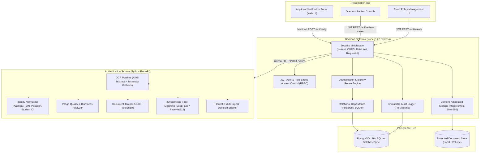

# VerifyID AI — Production Identity & Eligibility Verification Platform

[](https://github.com/Soumyajit-2808/ai-identity-verification/actions)
[](LICENSE)
[](https://nodejs.org/)
[](https://python.org/)
[](https://www.docker.com/)

VerifyID AI is a modular, multi-tenant identity verification gateway and computer vision microservice designed for hackathons, academic competitions, and enterprise onboarding workflows. The platform combines multi-engine OCR, image quality scoring, document tamper analysis, normalized rule-based eligibility evaluation, persistent cryptographic duplicate detection, and optional 2D facial vector comparison into an explainable, concurrency-safe verification pipeline.

---

## 1. Problem Statement & Solution

### The Problem
Hackathons, student events, and digital onboarding platforms face rampant registration fraud:
- **Impersonation & Duplicate Submissions**: Applicants upload someone else's document or register multiple times under different email addresses using the same identity card.
- **Underage or Ineligible Registrants**: Applicants falsify date of birth details during form entry that contradict the physical document.
- **Tampered & Illegible Credentials**: Users submit edited graphics, screenshots of screenshots, or blurry photos that evade naive validation checks.
- **Manual Review Bottlenecks**: Organizers are forced to manually inspect thousands of files or use "black-box" AI systems that fail silently without audit trails.

### The Solution
VerifyID AI replaces opaque pass/fail checks with an explainable multi-signal evidence pipeline:
1. **Automated Signal Extraction**: Deconstructs every upload into atomic signals (`OCR`, `QUALITY`, `TAMPER`, `ELIGIBILITY`, `NAME_MATCH`, `FACE_MATCH`, `DOCUMENT_TYPE`, `DUPLICATE_FILE`, `IDENTITY_REUSE`).
2. **Defensive Decision Synthesis**: Maps signals directly into unambiguous outcomes: `ELIGIBLE`, `INELIGIBLE`, or `REVIEW`.
3. **Cryptographic Deduplication**: Transactional SHA-256 file hashing and salted ID number indexing prevent duplicate assets and cross-registration identity reuse.
4. **Human-in-the-Loop Review Console**: Concurrency-safe operator queue with optimistic locking, document viewing, resolution notes, and immutable audit logs.

---

## 2. System Architecture

VerifyID AI uses a decoupled service architecture separating client orchestration, database persistence, and computer vision inference:



### Request Flow
1. **Submission**: Applicant submits a document image, optional selfie, registration name, and event code to `POST /api/verify`.
2. **Pre-Flight Validation**: Gateway inspects magic-byte headers (JPEG, PNG, WebP only; PDFs rejected), computes SHA-256 file hashes, and validates the event code.
3. **AI Inference**: Gateway forwards image buffers to the Python AI service (`POST /verify`).
4. **Signal Extraction**: AI service extracts identity attributes, measures blur/lighting, inspects tampering markers, verifies age against policy, fuzzy-matches names, and runs 2D facial vector comparison.
5. **Deduplication Check**: Gateway verifies exact file hashes and salted ID hashes against previous registrations for that event inside an atomic database transaction.
6. **Persistence & Routing**: Result is committed to the database. Clean passes are marked `ELIGIBLE`. Critical anomalies, duplicates, or mismatches are routed to `REVIEW` and generate an operator review case.
7. **Sanitized Response**: Public response receives masked identity fields (`XXXX-XXXX-1234`) and sanitized signals, protecting internal investigative evidence and preventing cross-participant PII leakage.

---

## 3. Verification Pipeline & Signal Taxonomy

The system evaluates 9 atomic verification signals:

| Signal Type | Evaluated Properties | Status Values | Primary Behavior |
| :--- | :--- | :--- | :--- |
| **`OCR`** | Extraction completeness of Name, Date of Birth, and ID number | `PASSED`, `REVIEW` | Requires all essential fields; flags missing fields for manual review |
| **`QUALITY`** | Laplacian blur variance, resolution, contrast, glare, and brightness | `PASSED`, `REVIEW`, `FAILED` | Rejects or flags unreadable, heavily blurred, or low-contrast images |
| **`TAMPER`** | EXIF editing software tags, quantization anomalies, aspect ratio skew | `PASSED`, `REVIEW` | Detects Photoshop, GIMP, Canvas edits, or visual compression anomalies |
| **`ELIGIBILITY`** | Age calculated from extracted DOB against event `minAge` and `maxAge` | `PASSED`, `REVIEW`, `FAILED` | `FAILED` triggers immediate `INELIGIBLE`. Ambiguous dates route to `REVIEW` |
| **`NAME_MATCH`** | Token-set, Jaro-Winkler, and Levenshtein similarity vs. registration name | `PASSED`, `REVIEW` | Tolerates minor spelling variations; flags substantial discrepancies |
| **`FACE_MATCH`** | DeepFace / FaceNet512 2D facial embedding Euclidean distance ($\le 0.30$) | `PASSED`, `REVIEW`, `SKIPPED`, `UNAVAILABLE` | Biometric vector comparison; runtime failure returns `UNAVAILABLE` |
| **`DOCUMENT_TYPE`** | Classification against event's configured `allowedIdTypes` | `PASSED`, `REVIEW` | Verifies extracted document format (e.g. `STUDENT_ID`, `PASSPORT`) |
| **`DUPLICATE_FILE`**| SHA-256 cryptographic document checksum across event registrations | `PASSED`, `REVIEW` | Detects re-upload of identical document assets |
| **`IDENTITY_REUSE`**| Salted SHA-256 hash of extracted legal ID number across event registrations | `PASSED`, `REVIEW` | Distinguishes resubmission by same person from cross-identity reuse |

---

## 4. Decision Outcomes & Scoring Model

### Decision Outcomes
Every verification attempt results in exactly one of three top-level decisions:
- **`ELIGIBLE`**: All required signals passed cleanly, no tamper or quality defects observed, age eligibility confirmed, name matches, and document is unique.
- **`INELIGIBLE`**: Definitive rule failure — applicant age strictly violates the event's minimum or maximum age threshold.
- **`REVIEW`**: Non-definitive anomaly or policy exception requiring human operator adjudication (e.g., conflicting names, suboptimal quality, duplicate documents, missing mandatory selfie, biometric mismatch, or biometric engine unavailable).

### Heuristic Scoring Model
> [!IMPORTANT]
> VerifyID AI scores are **heuristic decision-support indices**, not calibrated statistical probabilities.

1. **Evidence Score ($0.00 \dots 1.00$)**: Quantifies the positive corroboration across verified signals:
   - Base weights: `OCR` (+0.25), `ELIGIBILITY` (+0.25), `NAME_MATCH` (+0.20), `QUALITY` (+0.15), `TAMPER` (+0.15), `FACE_MATCH` (+0.15), `DOCUMENT_TYPE` (+0.10). Bounded to $1.0$.
2. **Risk Score ($0.00 \dots 1.00$)**: Aggregates anomaly indicators and defect penalties:
   - Tamper risk flags (+0.25 to +0.50), quality failures (+0.20 to +0.40), name mismatch (+0.35), facial mismatch (+0.45), duplicate document (+0.35), identity reuse (+0.40). Bounded to $1.0$.
3. **Confidence Score ($0.10 \dots 0.98$)**: Corroborated evidence discounted by detected risk:
   $$\text{Confidence} = \text{round}\Big(\min\big(0.98, \max\big(0.10, \text{evidence} \times (1.0 - (\text{risk} \times 0.7))\big)\big), 2\Big)$$

---

## 5. Biometric Face Verification Behavior & Limitations

### How Face Verification Works
- When a document and selfie are provided, the AI service extracts facial regions and runs 2D vector comparison using **DeepFace** with the **FaceNet512** model and OpenCV detector backend.
- Embeddings are compared using Euclidean L2 distance against a calibrated threshold of `0.30`.
- If distance $\le 0.30$, the signal is marked `PASSED`.
- If distance $> 0.30$, the signal is marked `REVIEW` (`MISMATCH`).
- If no face or multiple faces are detected, the signal is marked `REVIEW`.
- If a selfie is optional and omitted, the signal is marked `SKIPPED`.
- If a selfie is mandatory and omitted, the signal is marked `REVIEW`.
- **Failsafe Invariant**: If the biometric library or model crashes or is unavailable at runtime, the signal returns `UNAVAILABLE` and forces the overall decision to **`REVIEW`**. Biometric failure **never** yields `ELIGIBLE`.

### Explicit Biometric & Forensic Limitations
1. **2D Facial Comparison Only — No Active 3D Liveness Detection**:
   - VerifyID AI compares 2D static facial features. It **does NOT** perform active 3D liveness detection, eye-blink challenges, or presentation attack detection (PAD). It cannot detect printed photo replay or digital screen spoofing on its own.
2. **Heuristic Document Analysis — No Forensic Government Authority**:
   - The platform analyzes visual artifacts, EXIF metadata, and OCR consistency. It **does NOT** query government databases (UIDAI, NSDL, DMV) and does NOT cryptographically verify PKI digital signatures (e.g., Aadhaar secure QR code XML signatures or ISO 7816 smart chips).
3. **Synthetic Test Fixtures**:
   - The repository's automated fixtures (`valid_id.png`, `selfie.png`) are procedurally generated geometric drawings created to avoid committing real human PII to version control. DeepFace will report `REVIEW` (`Face detection could not complete`) when processing synthetic drawings. Live testing with real human photos exercises full 512-dimensional vector comparison.

---

## 6. Reviewer & Admin Workflow

When a verification routes to `REVIEW`, an atomic database transaction opens a record in the `review_cases` table:
- **Role-Based Access Control**:
  - `applicant`: Public verification submission only.
  - `reviewer`: View review queue, view stored document images, inspect signals, approve/reject cases.
  - `admin`: Full reviewer capabilities + event policy updates, audit trail queries, and metrics.
- **Optimistic Concurrency Locking**:
  - All review case updates enforce `lock_version` and status preconditions (`expectedStatus`). Concurrent updates by multiple reviewers return `409 Conflict`.
- **Mandatory Resolution Reasons**:
  - Operators must provide a justification note (`resolutionReason`) when transitioning a case to `APPROVED` or `REJECTED`.
- **Tenant Isolation**:
  - Reviewers and admins are scoped to their organization (`organization_id`). They cannot view or resolve review cases from other organizations.
- **Audit Logging**:
  - All operator actions (`USER_LOGIN`, `REVIEW_CASE_APPROVED`, `DOCUMENT_VIEWED`) are immutably logged with actor ID, role, IP address, and timestamp.

---

## 7. Local Development Setup

### System Prerequisites
- **Node.js**: `v22.5.0` or later (required for native `node:sqlite` DatabaseSync engine)
- **Python**: `v3.10` or `v3.11` (v3.11 recommended)
- **Tesseract OCR**: Optional for local OCR fallback (`tesseract-ocr` package or Windows installer)
- **PostgreSQL**: Optional for local testing (SQLite is used by default for zero-config local run)

### Active Service Ports
| Service | Local URL / Port | Description |
| :--- | :--- | :--- |
| **Backend Gateway & Web Portal** | `http://localhost:3000` | Express REST API & static web portal |
| **AI Verification Microservice** | `http://127.0.0.1:8001` | FastAPI computer vision microservice |
| **AI OpenAPI Documentation** | `http://127.0.0.1:8001/docs`| Interactive Swagger UI |
| **PostgreSQL** (Docker / Prod) | `localhost:5432` | Relational persistent store |

---

### Step-by-Step Native Run (Zero-Config SQLite)

1. **Clone the Repository**:
   ```bash
   git clone https://github.com/Soumyajit-2808/ai-identity-verification.git
   cd ai-identity-verification
   ```

2. **Configure Environment File**:
   ```bash
   cp .env.example .env
   # Default settings are preconfigured for local SQLite and AI service on port 8001
   ```

3. **Install & Launch AI Verification Service**:
   ```bash
   cd ai-service
   python -m venv venv
   # Windows PowerShell: .\venv\Scripts\Activate.ps1
   # Linux / macOS: source venv/bin/activate
   pip install -r requirements.txt
   # On Windows consoles, -X utf8 ensures UTF-8 stdout encoding for DeepFace logging
   python -X utf8 -m uvicorn main:app --host 127.0.0.1 --port 8001
   ```

4. **Install, Migrate & Launch Backend Gateway**:
   ```bash
   # In a separate terminal
   cd backend
   npm install
   npm run migrate    # Applies schema migrations and seeds default users & HACK2026 event
   npm start          # Starts production server (or 'npm run dev' for nodemon live reload)
   ```

5. **Access Application**:
   - **Verification Portal & Dashboard**: Open [http://localhost:3000](http://localhost:3000)
   - **Default Seeded Credentials**:
     - **Admin**: `admin@verifyid.local` / `Admin@12345`
     - **Reviewer**: `reviewer@verifyid.local` / `Reviewer@12345`
     - **Default Event Code**: `HACK2026`

---

### Containerized Deployment (Docker Compose with PostgreSQL)

To run the complete production multi-container stack with PostgreSQL 16:

```bash
docker compose up --build -d
```

Compose orchestrates:
- `verifyid_postgres`: PostgreSQL 16 on `127.0.0.1:5432` with automated schema initialization.
- `verifyid_ai_service`: FastAPI with OpenCV, Tesseract OCR, and DeepFace on `127.0.0.1:8001`.
- `verifyid_backend`: Node.js Express connected to PostgreSQL and AI service on `http://localhost:3000`.

---

## 8. Environment Variables Reference

### Backend Gateway (`backend`)
| Variable | Required | Default / Example | Purpose |
| :--- | :---: | :--- | :--- |
| `PORT` | No | `3000` | HTTP port for the Express gateway |
| `NODE_ENV` | No | `development` | Node runtime mode (`development`, `production`, `test`) |
| `DATABASE_URL` | **Yes** | `sqlite:./data/identity_verification.sqlite` | SQLite file URI or PostgreSQL connection string |
| `AI_SERVICE_URL` | **Yes** | `http://127.0.0.1:8001` | Base URL for downstream FastAPI service |
| `JWT_SECRET` | **Yes** | *(random 32+ char string)* | Secret for signing operator access tokens |
| `PII_SALT` | **Yes** | *(random 32+ char string)* | Salt used for hashing extracted ID numbers |
| `CORS_ORIGIN` | No | `http://localhost:3000` | Allowed origins for CORS requests |
| `STORAGE_PATH` | No | `./uploads/documents` | Filesystem path for encrypted document storage |
| `SCHEMA_PATH` | No | `../database/schema.sql` | Path to SQL schema definition file |

### AI Microservice (`ai-service`)
| Variable | Required | Default / Example | Purpose |
| :--- | :---: | :--- | :--- |
| `AI_CORS_ORIGIN` | No | `http://localhost:3000` | Allowed gateway origins for AI service |
| `AWS_REGION` | No | `us-east-1` | AWS region for Textract cloud OCR (optional) |
| `AWS_ACCESS_KEY_ID` | No | *(empty)* | AWS credentials for cloud OCR |
| `AWS_SECRET_ACCESS_KEY`| No | *(empty)* | AWS secret key for cloud OCR |
| `TESSERACT_CMD` | No | *(system PATH default)* | Absolute path to local tesseract executable |

---

## 9. API Reference

All endpoints return standardized JSON payloads. Protected endpoints require `Authorization: Bearer <JWT_TOKEN>`.

### Public Endpoints
- `GET /api/health`: System health, database connectivity, and AI service status.
- `GET /api/events`: List public events available for registration.
- `GET /api/events/:code`: Retrieve event policy configuration (age thresholds, required selfie, allowed IDs).
- `POST /api/verify`: Multipart verification request:
  - Form Fields: `file` (document image, required), `selfie` (applicant face image, optional), `registration_name` (string, required), `event_code` (string, required), `email` (optional), `phone` (optional).

### Operator & Reviewer Endpoints (`reviewer`, `admin`)
- `POST /api/auth/login`: Authenticate operator and receive JWT token.
- `GET /api/auth/me`: Get current authenticated user profile.
- `GET /api/review-cases`: List review cases with optional `?eventId=&status=&limit=`.
- `GET /api/review-cases/:id`: Get review case detail, raw signals, and audit trail.
- `PATCH /api/review-cases/:id`: Update review status (`IN_REVIEW`, `APPROVED`, `REJECTED`, `ESCALATED`) with optimistic lock precondition.
- `GET /api/documents/:id/file`: Securely stream stored document image with access logging.
- `GET /api/verifications`: List paginated verification history.
- `GET /api/verifications/:id`: Retrieve verification result and signal breakdown.
- `GET /api/metrics`: Retrieve verification throughput, decision counts, and review backlog.

### Administrator Endpoints (`admin`)
- `PATCH /api/events/:id`: Update event policy rules (`minAge`, `maxAge`, `allowedIdTypes`, `requireSelfie`, `strictNameMatching`).
- `GET /api/audit-logs`: Query immutable audit trail with `?entityType=&entityId=&limit=`.

---

## 10. Automated Testing Suite

The repository includes comprehensive automated test coverage across unit, integration, concurrency, and end-to-end scenarios.

### 1. Generate Synthetic Test Fixtures
```bash
python backend/tests/fixtures/generate_fixtures.py
```
Generates clean, synthetic, non-PII test documents (`valid_id.png`, `minor_id.png`, `different_name_id.png`, `blurry_id.png`, `selfie.png`).

### 2. Run Backend Tests (Jest)
```bash
cd backend
npm test
```
**Test Coverage Includes 8 Specialized Suites (72+ passing tests)**:
- `persistence.test.js`: Dual-engine SQLite/Postgres persistence, exact file deduplication, cross-registration identity reuse detection.
- `api.test.js`: Health diagnostics, rate limiting, JWT token generation, RBAC authorization, input validation.
- `e2e_scenarios.test.js`: Full multipart pipeline execution covering `ELIGIBLE` approvals, `INELIGIBLE` underage rejections, name mismatch `REVIEW` escalation, and review case resolution.
- `multitenancy.test.js`: Multi-tenant organization data isolation, event policy scoping, reviewer permission boundaries.
- `concurrency_invariants.test.js`: High-concurrency race condition testing, atomic review state transitions, optimistic locking (`lock_version`).
- `public_pii_sanitization.test.js`: Public API data minimization, ID masking (`XXXX-XXXX-1234`), raw OCR redaction, internal path stripping.
- `audit_corrections.test.js`: Comprehensive audit regression coverage for security hardening, atomic review transactions, and error sanitization.
- `postgres_integration.test.js`: Production PostgreSQL parity, transactional rollback guarantees, and migration verification.

### 3. Run AI Service Unit Tests
```bash
cd ai-service
python tests/run_tests.py
```
Tests cover international date parsing, multi-strategy fuzzy name matching, Laplacian blur variance, multi-signal evidence scoring, and biometric failsafe routing.

---

## 11. Security & Privacy Architecture

- **Data Minimization & Salted ID Hashing**: Plaintext ID numbers are never saved in the database. Extracted document numbers are hashed using SHA-256 with a secret salt (`PII_SALT`). Only masked strings (`XXXX-XXXX-1234`) are retained for operator confirmation.
- **Public Response Sanitization**: Public responses strip raw OCR transcripts, internal server file paths, and cross-participant registration references to prevent information leakage.
- **Content-Addressed Storage**: Uploaded files are verified via magic-byte inspection (JPEG, PNG, WebP) and stored under SHA-256 filenames, eliminating path traversal attacks.
- **Rate Limiting**: Multi-tiered rate limiters protect the API:
  - Auth: 5 failed attempts per 15 minutes.
  - Verification: 30 requests per 15 minutes per IP.
- **Auditability**: Every operator review decision, login, and document retrieval is logged in the append-only `audit_logs` table.

---

## 12. Hackathon / Demo Flow Walkthrough

Follow this 5-step walkthrough to demonstrate the complete verification lifecycle during a live presentation:

1. **Launch Services**:
   - Backend on `http://localhost:3000`
   - AI service on `http://127.0.0.1:8001`
2. **Submit Valid Registration (Happy Path — `ELIGIBLE`)**:
   - Open [http://localhost:3000](http://localhost:3000).
   - Enter Name: `Rahul Sharma`, Event Code: `HACK2026`.
   - Upload `backend/tests/fixtures/valid_id.png`.
   - Result: Instant **`ELIGIBLE`** decision with confidence score, OCR extraction, and passing quality signals.
3. **Submit Underage Document (Hard Rule — `INELIGIBLE`)**:
   - Enter Name: `Aarav Gupta`, Event Code: `HACK2026`.
   - Upload `backend/tests/fixtures/minor_id.png`.
   - Result: Instant **`INELIGIBLE`** rejection; applicant age violates the 18+ requirement.
4. **Submit Conflicting Name / Identity Reuse (`REVIEW`)**:
   - Enter Name: `Different Person`, Event Code: `HACK2026`.
   - Upload `backend/tests/fixtures/valid_id.png`.
   - Result: Instant **`REVIEW`** routing; duplicate document and name discrepancy flagged.
5. **Operator Review Queue & Resolution**:
   - Click "Operator Sign In" and log in with `reviewer@verifyid.local` / `Reviewer@12345`.
   - Navigate to the **Review Queue** tab.
   - Click the flagged case, view the submitted document image, inspect atomic signals, enter a resolution justification note, and click **Approve** or **Reject**.
   - Review status updates in real time with optimistic locking and an immutable audit log entry.

---

## 13. License

This project is licensed under the MIT License - see the [LICENSE](LICENSE) file for details.
