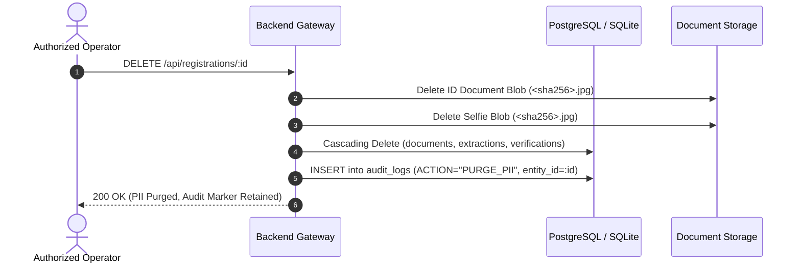

# Privacy & Data Governance Architecture

This document details the data privacy mechanisms, retention policies, cryptographic protections, and compliance standards designed into the platform for processing Personally Identifiable Information (PII) and biometric data.

---

## 1. Principles of Data Governance

The platform adheres to four foundational data protection principles:

1. **Data Minimization**:
   - Only fields directly relevant to eligibility verification (e.g., Full Name, Date of Birth, ID Number, ID Type, Institution, Expiry Date) are extracted and persisted.
   - Irrelevant personal data present on government IDs (e.g., father's name, blood group, religious markers, residential address) are omitted from extraction schemas unless explicitly required by event policy.
2. **Purpose Limitation**:
   - Applicant verification records are scoped strictly to the specific `event_id` and `organization_id` under which registration was submitted.
3. **Storage Limitation (Configurable Retention)**:
   - Verification documents and selfies are not stored permanently by default.
   - The platform supports configurable document retention windows (e.g., 30 days post-event completion), after which raw media blobs are scheduled for cryptographic purge.
4. **Integrity & Confidentiality**:
   - Sensitive ID numbers are indexed using cryptographic hashes.
   - Raw media files reside on encrypted volumes or private object storage buckets inaccessible to the public internet.

---

## 2. PII Classification & Data Handling Matrix

| Data Element | Storage Location | Encryption at Rest | Masked in Logs | Retention Default |
| :--- | :--- | :---: | :---: | :--- |
| **Government ID Image** | Local Secure Storage / S3 | AES-256 | Excluded | 30 Days (Configurable) |
| **Selfie Image** | Local Secure Storage / S3 | AES-256 | Excluded | 30 Days (Configurable) |
| **ID Number** | `extracted_identities.id_number` | Column / DB Encryption | Masked (`****1234`) | Scoped to Event Lifecycle |
| **ID Number Hash** | `identity_registry.id_number_hash` | SHA-256 with Salt | Full Hash | Permanent (Fraud Prevention) |
| **Date of Birth** | `extracted_identities.dob` | Standard DB Field | Masked | Scoped to Event Lifecycle |
| **Face Biometric Vectors** | Ephemeral RAM (DeepFace) | Not stored permanently | Excluded | Discarded after inference |
| **Audit Logs** | `audit_logs` | Immutable DB Table | Redacted PII | 1 Year (Legal Audit Trail) |

---

## 3. Biometric Data Protection

Biometric verification (selfie-to-document face comparison) introduces stringent privacy obligations:

- **No Permanent Biometric Vector Databases**:
  - DeepFace / FaceNet512 embeddings are computed in-memory during request processing and are **never** serialized into long-term relational tables.
  - Only the resulting scalar metrics (`verified: bool`, `distance: float`, `similarity: float`, `threshold: float`, `detector_backend: string`) are saved in `face_verifications`.
- **Presentation Attack Disclaimer**:
  - The platform explicitly discloses that standard 2D selfie matching does not guarantee liveness or presentation attack prevention.
- **Biometric Consent Marker**:
  - Verification requests can record an explicit `biometricConsent: true` flag in the submission metadata to document applicant authorization.

---

## 4. Deletion & Right to Be Forgotten (GDPR / DPDP Compliance)

When an applicant exercises their right to data deletion:

1. **Blob Deletion**: The underlying media files are unlinked from the filesystem or deleted from S3.
2. **Relational Cascade**: Foreign keys with `ON DELETE CASCADE` remove `documents`, `extracted_identities`, `verification_signals`, and `face_verifications`.
3. **Audit Trail Anonymization**: The `audit_logs` entry retains the action type (`PII_PURGED`) and timestamp, but anonymizes all associated applicant personal data.
