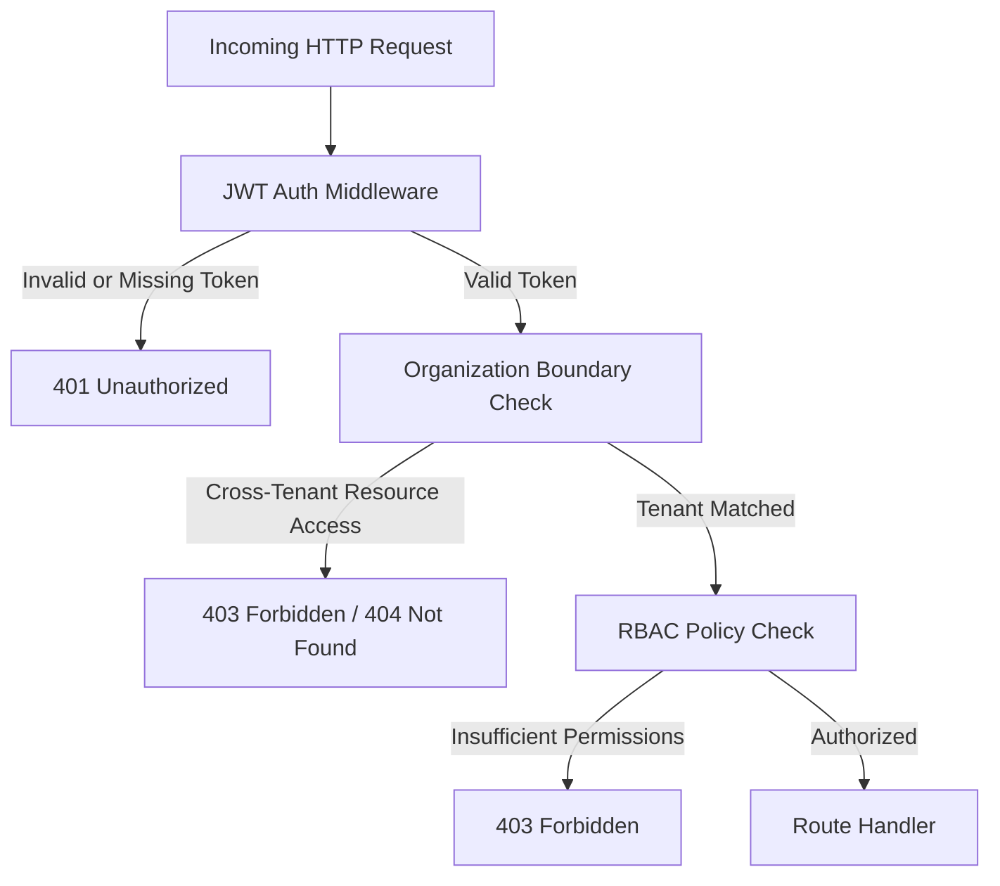

# Security Architecture & Threat Model

This document outlines the security controls, threat models, input validation policies, and defensive measures implemented across the AI Identity Verification Platform.

---

## 1. Threat Modeling (STRIDE Matrix)

| Threat Category | Potential Attack Vector | Platform Defensive Mitigation |
| :--- | :--- | :--- |
| **Spoofing** | Attacker impersonates an applicant or an event reviewer | JWT tokens with HMAC-SHA256 signatures, role verification middleware (`admin`, `reviewer`, `operator`), constant-time token comparison. |
| **Tampering** | Modification of document payload, EXIF metadata tampering, or SQL parameter injection | Cryptographic file hashing (SHA-256), magic-byte file inspection, parameter binding across dual-engine DB connection layer, strict Pydantic schemas. |
| **Repudiation** | Operator denies reviewing or overriding a verification decision | Append-only `audit_logs` table recording operator ID, action name, target entity ID, IP address, timestamp, and previous vs new states. |
| **Information Disclosure** | Leakage of identity documents, ID numbers, or applicant PII in system logs or client responses | Automatic regex PII masking in structured logs (`[REDACTED]`), content-addressed disk storage with random UUID/SHA-256 keys, stack trace sanitization in API error handlers. |
| **Denial of Service** | Resource exhaustion via multi-gigabyte uploads, zip bombs, or high-frequency OCR requests | Tiered Express rate-limiting (300 req/15 min global, 20 req/15 min auth, 30 req/15 min ML verification), strict 12MB payload thresholds, and request cancellation boundaries. |
| **Elevation of Privilege** | Normal user accesses review queue or overrides verification status | Explicit RBAC middleware (`requireRole(['admin', 'reviewer'])`) and strict multi-tenant boundary checks blocking unauthorized access or mutation across organizations. |

---

## 2. Authentication & Role-Based Access Control (RBAC)

The platform enforces zero-trust role separation and strict multi-tenant organization isolation:



### Role Matrix

| Role | Verification Submission | View Public Result | View Review Queue | Resolve Review Cases | Edit Event Policies | Access Organization Audit Logs |
| :--- | :---: | :---: | :---: | :---: | :---: | :---: |
| **Anonymous / Public** | Yes | Yes (Session only) | No | No | No | No |
| **Reviewer** | Yes | Yes | Yes (Scoped) | Yes (Scoped) | No | No |
| **Administrator** | Yes | Yes | Yes (Scoped) | Yes (Scoped) | Yes (Scoped) | Yes (Scoped) |

---

## 3. Upload Security & File Handling

To prevent arbitrary code execution, malicious polyglot files, and directory traversal:

1. **Magic-Byte Header Validation**:
   - The file extension is completely ignored for MIME determination.
   - The first 12 bytes of every uploaded file buffer are inspected against known byte signatures:
     - **JPEG**: `0xFF, 0xD8, 0xFF`
     - **PNG**: `0x89, 0x50, 0x4E, 0x47, 0x0D, 0x0A, 0x1A, 0x0A`
     - **WebP**: `RIFF....WEBP`
     - **PDF**: `%PDF-` (`0x25, 0x50, 0x44, 0x46`)
2. **Content Addressing & Path Traversal Prevention**:
   - Files are stored on disk using their computed `SHA-256` checksum: `<sha256>.<clean_ext>`.
   - Client-provided filenames (`req.file.originalname`) are sanitized via regex (`[^a-zA-Z0-9._-]`) and never used directly as disk paths.
3. **Storage Isolation & Automatic Cleanup**:
   - Upload directory permissions are restricted.
   - Files cannot be directly browsed or executed via HTTP GET; they are retrieved strictly through authenticated, tenant-verified API streams.
   - If AI processing fails or the database transaction aborts, temporary files are immediately deleted from disk to prevent orphaned files.

---

## 4. Input Validation & Injection Defenses

### SQL / Parameter Injection
All database queries in `backend/src/db/repositories/` utilize positional parameter binding:
- **PostgreSQL**: Bound parameters (`$1, $2, ...`).
- **SQLite**: Positional placeholders (`?`). The connection adapter tracks parameter bindings and automatically maps input arguments safely.

### Subprocess / Command Injection
The AI verification service does not invoke external shell commands dynamically. The Tesseract OCR provider passes image buffers directly through `pytesseract` Python APIs using temporary file paths generated by standard library `tempfile.NamedTemporaryFile` with explicit cleanup.

### Cross-Site Scripting (XSS)
- The frontend operates with strict separation between data and rendering, using `textContent`, `setAttribute`, and DOM node construction.
- Express security headers (`Helmet`) enforce CSP, frameguard (`X-Frame-Options: DENY`), and MIME-type sniffing prevention.

---

## 5. PII Masking & Logging Protections

Structured JSON logs generated by `backend/src/middleware/logger.js` record request correlation metadata while strictly omitting sensitive applicant payloads (such as raw biometric buffers, identity images, and full legal names) from standard HTTP access logs by design:

```json
{
  "requestId": "6b2a4e90-2ef8-4903-b0bf-2b7e9bf1f623",
  "method": "POST",
  "url": "/api/verify",
  "statusCode": 200,
  "durationMs": 420,
  "ip": "127.0.0.1",
  "userAgent": "Mozilla/5.0..."
}
```

- Raw image buffers and multipart file bodies are never serialized into stdout or log aggregators.
- Verification and audit records stored in the database mask identity numbers (e.g. `********9012`) before persistence.

---

## 6. Audit Trail Immutability

The `audit_logs` table records every critical action within the platform:
- `VERIFICATION_SUBMITTED`
- `DECISION_GENERATED`
- `REVIEW_ASSIGNED`
- `REVIEW_RESOLVED`
- `EVENT_POLICY_UPDATED`

Audit records contain `operator_id`, `client_ip`, `user_agent`, `target_entity_type`, `target_entity_id`, and `payload_json`. Once inserted, audit records cannot be updated or deleted by normal application accounts.
