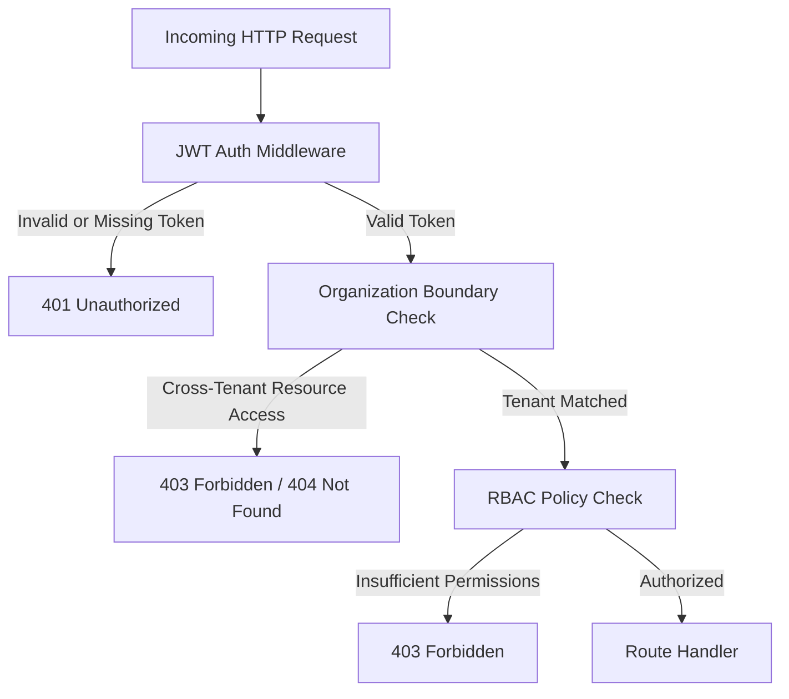

# Security Architecture & Threat Model

This document outlines the security controls, threat models, input validation policies, and defensive measures implemented across the AI Identity Verification Platform.

---

## 1. Threat Modeling (STRIDE Matrix)

| Threat Category | Potential Attack Vector | Platform Defensive Mitigation |
| :--- | :--- | :--- |
| **Spoofing** | Attacker impersonates an applicant or an event reviewer | JWT tokens with HMAC-SHA256 signatures (`HS256`), role verification middleware (`admin`, `reviewer`, `organizer`), cryptographic secret validation (`JWT_SECRET`). |
| **Tampering** | Modification of document payload, EXIF metadata tampering, or SQL parameter injection | Cryptographic file hashing (SHA-256), magic-byte binary header inspection, parameterized query binding across dual-engine DB connection layer, strict Pydantic request schemas. |
| **Repudiation** | Operator denies reviewing or overriding a verification decision | Application-level append-only `audit_logs` table recording operator ID, action name, target entity ID, IP address, timestamp, and detailed transition metadata. |
| **Information Disclosure** | Leakage of identity documents, ID numbers, or applicant PII in system logs or client responses | Salted HMAC-SHA256 ID number indexing (`PII_SALT`), ID masking (`********9012`), omission of internal `storage_path` from API responses, sanitized database error logging without raw parameters, stack trace sanitization in API error handlers. |
| **Denial of Service** | Resource exhaustion via multi-gigabyte uploads, zip bombs, or high-frequency OCR requests | Tiered Express rate-limiting (300 req/15 min global, 20 req/15 min auth, 30 req/15 min ML verification), strict 12MB payload thresholds in both Node gateway and FastAPI service. |
| **Elevation of Privilege** | Normal user accesses review queue or overrides verification status | Explicit RBAC middleware (`requireRole(['admin', 'reviewer'])`) and strict multi-tenant boundary checks blocking unauthorized cross-organization queries and mutations. |

---

## 2. Authentication & Role-Based Access Control (RBAC)

The platform enforces zero-trust role separation and strict multi-tenant organization isolation:



### Role Matrix

| Role | Verification Submission | View Public Result | View Review Queue | Resolve Review Cases | Edit Event Policies | Access Organization Audit Logs |
| :--- | :---: | :---: | :---: | :---: | :---: | :---: |
| **Anonymous / Public** | Yes | Yes (Current submission) | No | No | No | No |
| **Reviewer** | Yes | Yes | Yes (Scoped) | Yes (Scoped) | No | No |
| **Organizer** | Yes | Yes | Yes (Scoped) | Yes (Scoped) | Yes (Scoped) | No |
| **Administrator** | Yes | Yes | Yes (Scoped) | Yes (Scoped) | Yes (Scoped) | Yes (Scoped) |

---

## 3. Upload Security & File Handling

To prevent arbitrary code execution, polyglot uploads, and directory traversal:

1. **Magic-Byte Binary Inspection**:
   - The file extension is completely ignored for MIME determination.
   - The first 12 bytes of every uploaded file buffer are inspected against known binary signatures:
     - **JPEG**: `0xFF, 0xD8, 0xFF`
     - **PNG**: `0x89, 0x50, 0x4E, 0x47, 0x0D, 0x0A, 0x1A, 0x0A`
     - **WebP**: `RIFF....WEBP`
   - **PDF documents are explicitly rejected** with a 400 Bad Request error to guarantee compatibility with the image-based computer vision pipeline.
2. **Content Addressing & Path Traversal Prevention**:
   - Files are stored on disk using their computed `SHA-256` checksum and timestamp: `<sha256>_<timestamp>.<clean_ext>`.
   - Client-provided filenames (`req.file.originalname`) are sanitized via regex and never used directly as disk paths.
3. **Storage Isolation & Automatic Cleanup**:
   - Files cannot be directly browsed or executed via static HTTP GET; they are retrieved strictly through authenticated, tenant-verified API streams.
   - Internal filesystem storage paths (`storage_path`) are stripped from API outputs.
   - If AI processing fails or the database transaction aborts, temporary uploaded files are immediately unlinked from disk to prevent orphaned storage accumulation.

---

## 4. Input Validation & Injection Defenses

### SQL / Parameter Injection
All database queries in `backend/src/db/repositories/` utilize positional parameter binding:
- **PostgreSQL**: Positional parameters (`$1, $2, ...`).
- **SQLite**: Positional placeholders (`?`). The connection adapter tracks parameter bindings and automatically maps input arguments safely.

### Subprocess / Command Injection
The AI verification service does not invoke external shell commands dynamically. The Tesseract OCR provider passes image buffers directly through `pytesseract` Python APIs using temporary file paths generated by standard library `tempfile.NamedTemporaryFile` with explicit cleanup.

### Cross-Site Scripting (XSS)
- The frontend uses `escapeHtml()` escaping functions and DOM attribute sanitization before rendering dynamic API data.
- Express security headers (`Helmet`) enforce frameguard (`X-Frame-Options: DENY`) and MIME-type sniffing prevention. Note: Content Security Policy (CSP) is currently disabled in Helmet for local development convenience.

---

## 5. PII Masking & Logging Protections

Structured JSON logs generated by `backend/src/middleware/logger.js` record request correlation metadata while omitting applicant payloads from HTTP access logs:

```json
{
  "requestId": "6b2a4e90-2ef8-4903-b0bf-2b7e9bf1f623",
  "method": "POST",
  "url": "/api/verify",
  "statusCode": 200,
  "durationMs": 420,
  "ip": "127.0.0.1",
  "userAgent": "Mozilla/5.0..."
}
```

- Raw image buffers and multipart file bodies are never serialized into stdout or log aggregators.
- Verification and audit records stored in the database mask identity numbers (e.g. `********9012`) before persistence.
- Database error logs record error codes, query snippets, parameter counts, and database engines without logging raw parameter values.

---

## 6. Audit Trail Immutability

The `audit_logs` table records critical platform actions:
- `VERIFICATION_SUBMITTED`
- `DECISION_GENERATED`
- `REVIEW_CASE_IN_REVIEW`
- `REVIEW_CASE_APPROVED`
- `REVIEW_CASE_REJECTED`
- `EVENT_POLICY_UPDATED`
- `DOCUMENT_VIEWED`

Audit records contain `actor_id`, `actor_role`, `action`, `entity_type`, `entity_id`, `event_id`, `details_json`, `ip_address`, and `created_at`.
At the application API layer, audit logs are append-only: no routes or repository methods exist to modify or delete audit log entries.
